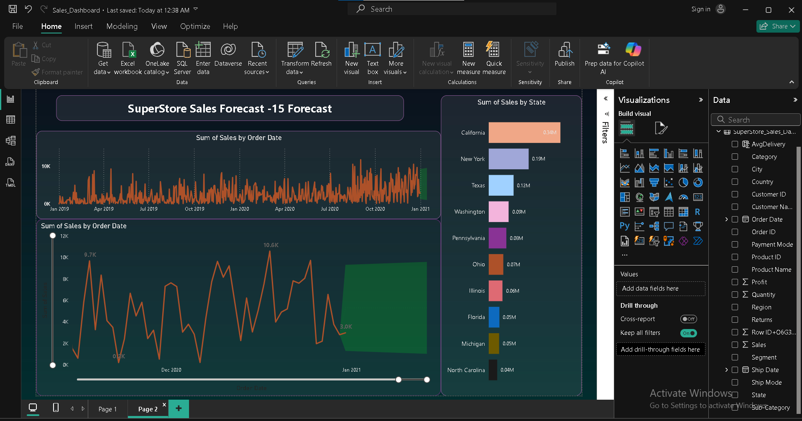

# customer-segmentation-sales-forecasting
Power BI project analyzing customer segments for sales forecasting using data visualization and insights.
# Customer Segmentation for Sales Forecasting 📊

## 📌 Overview
This project is built in **Power BI** to analyze customer segments and forecast future sales trends.  
It provides insights into **which customer groups contribute most to revenue** and helps in **predicting future sales growth**.

## 🎯 Objective
- Segment customers by region, category, and purchase behavior.
- Forecast sales for upcoming months using trend analysis.
- Provide data-driven insights for business decision-making.

## 🛠 Tools & Technologies
- Power BI (Data Visualization, DAX, Forecasting)
- Excel / CSV Dataset
- Data Cleaning & Modeling

## 🔎 Key Insights
- Top-performing customer segments by sales volume.
- Sales forecast for next months/quarters.
- Category-wise contribution to revenue.
- Regional performance comparison.

## 📷 Dashboard Preview

## 📂 Files
- `customer-segmentation-sales-forecasting.pbix` → Power BI dashboard file.
- `dashboard.png` → Preview of the dashboard.

## 🚀 How to Use
1. Download the `.pbix` file.
2. Open it in **Power BI Desktop**.
3. Explore the interactive dashboard.

---
👩‍💻 Developed by [Swati](https://github.com/Swati4300)
