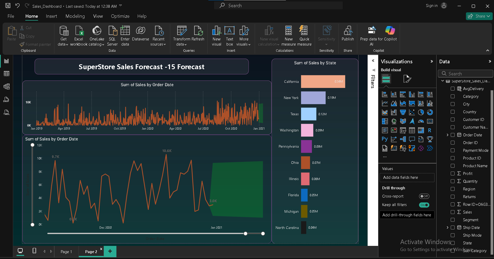

# customer-segmentation-sales-forecasting
Power BI project analyzing customer segments for sales forecasting using data visualization and insights.
# Customer Segmentation for Sales Forecasting 📊

## 📌 Overview
This project is built in **Power BI** to analyze customer segments and forecast future sales trends.  
It provides insights into **which customer groups contribute most to revenue** and helps in **predicting future sales growth**.

# Superstore Sales Analysis & Forecasting (Power BI)

**Business question:** Which segments, categories and states drive sales and profit, and where are sales headed next?

## Key Findings
- Sales grew about 77% from 2019 to 2020 (about 565K to 1.0M), peaking in December 2020
- California (335K) and New York (187K) are the top states by sales and are both profitable
- Texas, Pennsylvania and Ohio have high sales but are loss-making, so sales rank alone hides real losses
- Furniture earns 451K in sales but only a 2.2% margin, versus 19.2% for Technology
- Consumer customers generate 48% of sales, Corporate 33%, Home Office 19%
- Forecast shows rising / falling / flat sales over the next 15 days]

## Dashboard Preview

## Data
- Source: Superstore sales dataset from Kaggle
- Size: 5,901 rows, 23 columns (Jan 2019 to Dec 2020)
- Key columns: Order Date, Segment, Region, State, Category, Sub-Category, Sales, Quantity, Profit

## What I Did
- Cleaned and shaped the data in Power bi
- Built visuals for sales by state and sales over time
- Used Power BI's forecasting (Analytics pane) to project sales for the next [15 days/months]

## Files
- `Sales_Dashboard.pbix`: Power BI file (needs Power BI Desktop)
- `Forecasting_screenshot.png`: dashboard preview

Built by [Swati](https://github.com/Swati4300)

## 🎯 Objective
- Segment customers by region, category, and purchase behavior.
- Forecast sales for upcoming months using trend analysis.
- Provide data-driven insights for business decision-making.

## 🛠 Tools & Technologies
- Power BI (Data Visualization, DAX, Forecasting)
- Excel / CSV Dataset
- Data Cleaning & Modeling

## 🔎 Key Insights
- Top-performing customer segments by sales volume.
- Sales forecast for next months/quarters.
- Category-wise contribution to revenue.
- Regional performance comparison.

## 📷 Dashboard Preview

## 📂 Files
- `customer-segmentation-sales-forecasting.pbix` → Power BI dashboard file.
- `dashboard.png` → Preview of the dashboard.

## 🚀 How to Use
1. Download the `.pbix` file.
2. Open it in **Power BI Desktop**.
3. Explore the interactive dashboard.

---
👩‍💻 Developed by [Swati](https://github.com/Swati4300)
